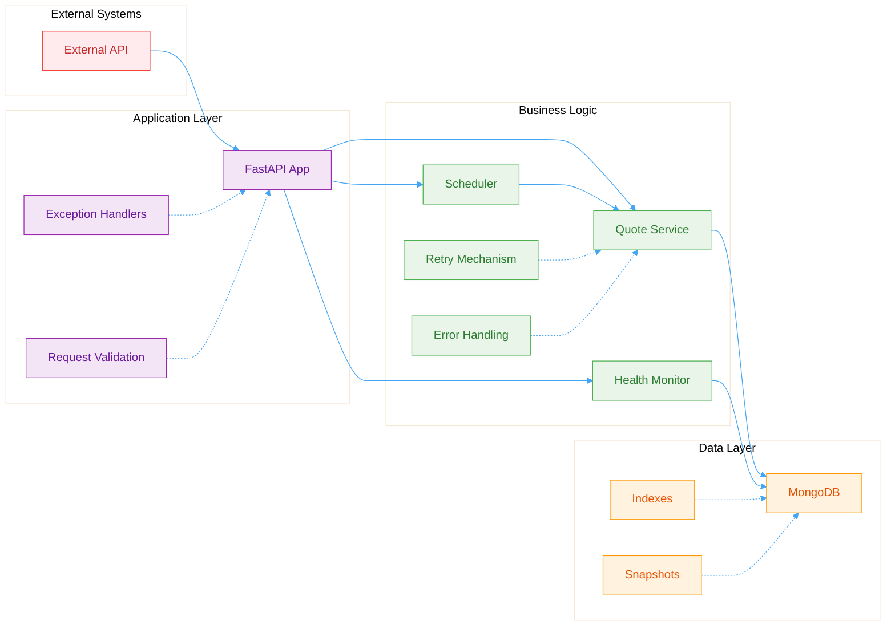

# 🏦 PIX Historial - PIX Exchange Rate Tracker

[](https://github.com/Giygas/pix-historial/actions/workflows/deploy.yml)
[](https://github.com/yourusername/pix-historial)
[](https://www.python.org/downloads/)
[](https://fastapi.tiangolo.com)
[](LICENSE)

A robust FastAPI application that tracks and analyzes PIX exchange rates from multiple financial apps, collecting data every 15 minutes to provide historical insights and price variance analysis.

## 🌟 About PIX

### What is PIX?

PIX is Brazil's instant payment system, launched in 2020 by Banco Central do Brasil. It's not a cryptocurrency but a real-time payment method in Brazilian Reais (R$).

Users can transact using:

- 📱 Phone numbers
- 🆔 CPF (Cadastro de Pessoas Físicas)
- 📧 Email addresses
- 🔑 Random keys

## 🏗️ Architecture Overview



## 🛠️ Tech Stack

### Backend Framework

- **FastAPI 0.116+** - Modern, fast web framework for building APIs
- **Pydantic 2.11+** - Data validation using Python type annotations
- **Uvicorn** - ASGI server for production deployment

### Database & Storage

- **MongoDB** - NoSQL database for storing historical rate data
- **PyMongo** - Python driver for MongoDB
- **Optimized Indexes** - Time-based and compound indexes for fast queries

### Background Processing

- **APScheduler** - Advanced Python Scheduler for periodic tasks
- **AsyncIO** - Asynchronous I/O for concurrent operations

### Reliability & Error Handling

- **Exponential Backoff** - Intelligent retry mechanism with jitter
- **Custom Exception Hierarchy** - Structured error handling
- **Circuit Breaker Pattern** - Resilience against external API failures

### Development & Testing

- **Pytest 8.3+** - Testing framework with async support
- **80% Test Coverage** - Comprehensive test suite
- **Code Quality Tools** - Black, Ruff, Pylint, MyPy
- **Pre-commit Hooks** - Automated code quality checks

### Deployment & CI/CD

- **GitHub Actions** - Automated deployment pipeline
- **Environment Configuration** - Secure settings management

## 🚀 Features

### Core Functionality

- ⏰ **Automated Data Collection** - Configurable cron-based scheduling (default: every 15 minutes at :00, :15, :30, :45)
- 📊 **Historical Tracking** - Stores complete rate history
- 📈 **Variance Analysis** - Track price changes over time
- 🔍 **Multi-App Support** - Compare rates across different apps

### API Features

- 🌐 **RESTful API** - Clean, intuitive endpoints
- 📚 **Auto Documentation** - OpenAPI/Swagger docs at `/docs`
- 🔍 **Advanced Filtering** - Query by time ranges and apps
- ✅ **Input Validation** - Comprehensive request validation

### Reliability Features

- 🔄 **Automatic Retries** - Resilient to network failures
- 🛡️ **Error Handling** - Graceful error responses
- 💾 **Data Integrity** - Validated data models
- 🏥 **Health Monitoring** - Built-in health checks

## 📦 Installation

### Prerequisites

- Python 3.13+
- MongoDB 4.4+
- Git

### Clone & Setup

```bash
# Clone the repository
git clone https://github.com/Giygas/pix-historial.git
cd pix-historial

# Create virtual environment
python -m venv venv
source venv/bin/activate  # On Windows: venv\Scripts\activate

# Install dependencies
pip install -r requirements.txt
```

### Configuration

```bash
# Copy environment template
cp .env.example .env

# Edit configuration
nano .env
```

Required environment variables:

```env
# Database
MONGO_URI=mongodb://localhost:27017
DB_NAME=pix_historial

# External API
QUOTES_API_URL=https://pix.ferminrp.com/quotes

# Collection Settings
COLLECTION_CRON="*/15"  # Cron expression: "*/15" = every 15 minutes at :00, :15, :30, :45

# API Settings
API_TITLE="PIX Historial API"
API_VERSION=1.0.0
```

### ⏰ Scheduling Configuration

The application uses cron-based scheduling for predictable data collection. Configure the `COLLECTION_CRON` environment variable:

**Common Scheduling Patterns:**

```env
# Every 15 minutes at :00, :15, :30, :45 (default)
COLLECTION_CRON="*/15"

# Every 10 minutes at :00, :10, :20, :30, :40, :50
COLLECTION_CRON="*/10"

# Every 5 minutes
COLLECTION_CRON="*/5"

# Every 30 minutes at :00 and :30
COLLECTION_CRON="0,30"

# Every hour at :00
COLLECTION_CRON="0"

# Business hours only (9 AM - 6 PM, every 15 minutes)
COLLECTION_CRON="*/15"
# Note: Add hour="9-18" in code for business hours restriction
```

**Benefits of Cron Scheduling:**

- 🎯 **Predictable timing**: Always runs at the same minute marks
- 🔄 **Server restart friendly**: Aligns to schedule regardless of restart time
- ⚡ **Flexible patterns**: Support complex scheduling needs
- 📊 **Consistent data**: Regular intervals for better analysis

## 🏃‍♂️ Running the Application

### Development Mode

```bash
# Run with auto-reload
uvicorn app.main:app --reload --host 0.0.0.0 --port 8000

# Or using the root path
uvicorn app.main:app --reload --root-path /pix-historial
```

### Production Mode

```bash
# Run with workers
uvicorn app.main:app --host 0.0.0.0 --port 8000 --workers 4
```

## 📚 API Documentation

### Base URL

```
http://localhost:8000/pix-historial
```

### Endpoints

#### 🏠 Root

```http
GET /
```

Returns basic API information.

#### 📊 Latest Rates

```http
GET /latest
```

Get the most recent quote snapshot.

**Response:**

```json
{
  "id": "latest",
  "timestamp": "2024-01-15T10:30:00Z",
  "quotes": [
    { "app_name": "app1", "rate": 5.23 },
    { "app_name": "app2", "rate": 5.25 }
  ],
  "total_apps": 2
}
```

#### 📈 App History

```http
GET /apps/{app_name}?hours=24
```

Get rate history for a specific app.

**Parameters:**

- `app_name` (path): Name of the app
- `hours` (query): Time range in hours (1-168, default: 24)

**Response:**

```json
{
  "app_name": "app1",
  "history": [
    { "timestamp": "2024-01-15T10:30:00Z", "rate": 5.23 },
    { "timestamp": "2024-01-15T10:15:00Z", "rate": 5.22 }
  ],
  "total_records": 2
}
```

#### 🏥 Health Check

```http
GET /health
```

Check application and database health.

**Response:**

```json
{
  "status": "healthy",
  "database": "connected",
  "last_update": "2024-01-15T10:30:00Z",
  "timestamp": "2024-01-15T10:31:00Z",
  "uptime": "2:30:15",
  "mongo_ping": "2.5 ms"
}
```

### Interactive Documentation

- **Swagger UI**: `http://localhost:8000/pix-historial/docs`
- **ReDoc**: `http://localhost:8000/pix-historial/redoc`

## 🧪 Testing

### Run All Tests

```bash
# Quick test run
python -m pytest tests/ -v

# With coverage
python -m pytest tests/ --cov=app --cov-report=term-missing

# Full test suite with HTML coverage
python run_tests.py
```

### Test Categories

```bash
# Unit tests only
python -m pytest tests/test_models.py -v

# Service tests only
python -m pytest tests/test_services_simple.py -v

# API tests only
python -m pytest tests/test_api_simple.py -v
```

### Test Coverage

- **Overall Coverage**: 80%
- **Tests Passing**: 42/42 (100%)
- **Coverage Report**: `htmlcov/index.html`

## 🔧 Error Handling

The application implements comprehensive error handling with structured responses:

### Error Response Format

```json
{
  "error": "QuoteAPIConnectionError",
  "message": "External API service is currently unavailable",
  "details": {
    "url": "https://api.example.com/quotes"
  },
  "timestamp": "2024-01-15T10:30:00Z",
  "request_id": "req_123456",
  "path": "/latest"
}
```

### Exception Types

- `QuoteAPIConnectionError` - External API connection issues
- `QuoteAPITimeoutError` - API request timeouts
- `QuoteDatabaseError` - Database operation failures
- `QuoteDataValidationError` - Data validation issues
- `QuoteDataParsingError` - Response parsing errors

### Retry Mechanism

- **Exponential Backoff** - Intelligent retry delays
- **Jitter** - Prevents thundering herd
- **Configurable Attempts** - Different settings per operation type
- **Circuit Breaking** - Stops retrying after consecutive failures

## 📊 Monitoring & Observability

### Health Monitoring

- Database connectivity checks
- API response time monitoring
- Background task status
- System uptime tracking

### Logging

- Structured JSON logging
- Different log levels for different environments
- Request correlation IDs
- Error context preservation

### Metrics

- MongoDB query performance
- API response times
- Error rates by type
- Background task success rates

## 🚀 Deployment

### Manual Deployment

```bash
# Pull latest changes
git pull origin main

# Install dependencies
pip install -r requirements.txt

# Restart service
sudo systemctl restart pix-historial
```

### Automated Deployment

The project includes GitHub Actions for automated deployment:

- Triggers on push to main branch
- Runs tests before deployment
- Deploys via SSH to production server
- Restarts the service automatically

### Environment Setup

```bash
# Create systemd service
sudo nano /etc/systemd/system/pix-historial.service
```

```ini
[Unit]
Description=PIX Historial API
After=network.target

[Service]
User=www-data
Group=www-data
WorkingDirectory=/path/to/pix-historial
Environment=PATH=/path/to/pix-historial/venv/bin
ExecStart=/path/to/pix-historial/venv/bin/uvicorn app.main:app --host 0.0.0.0 --port 8000
Restart=always

[Install]
WantedBy=multi-user.target
```

```bash
# Enable and start service
sudo systemctl enable pix-historial
sudo systemctl start pix-historial
```

## 🤝 Contributing

We welcome contributions! Please follow these guidelines:

### Development Workflow

1. Fork the repository
2. Create a feature branch: `git checkout -b feature/amazing-feature`
3. Make your changes
4. Run tests: `python run_tests.py`
5. Commit your changes: `git commit -m 'Add amazing feature'`
6. Push to branch: `git push origin feature/amazing-feature`
7. Open a Pull Request

### Code Quality Standards

- Follow PEP 8 style guidelines
- Add tests for new features
- Update documentation
- Ensure 80%+ test coverage
- Use meaningful commit messages

### Pre-commit Hooks

```bash
# Install pre-commit hooks
pre-commit install

# Run manually
pre-commit run --all-files
```

## 📝 Project Structure

```
pix-historial/
├── app/
│   ├── __init__.py
│   ├── main.py          # FastAPI application and routes
│   ├── config.py        # Configuration management
│   ├── database.py      # MongoDB operations
│   ├── models.py        # Pydantic models
│   ├── services.py      # Business logic
│   ├── exceptions.py    # Custom exceptions
│   ├── utils.py         # Utility functions
│   └── logger.py        # Logging configuration
├── tests/
│   ├── __init__.py
│   ├── conftest.py      # Test configuration
│   ├── test_api.py      # API endpoint tests
│   ├── test_models.py   # Model validation tests
│   └── test_services.py # Service layer tests
├── .github/
│   └── workflows/
│       └── deploy.yml   # CI/CD pipeline
├── requirements.txt     # Python dependencies
├── pytest.ini         # Test configuration
├── .env.example       # Environment template
├── .gitignore         # Git ignore rules
└── README.md          # This file
```

## 🔐 Security Considerations

- Environment variables for sensitive configuration
- Input validation on all API endpoints
- Rate limiting considerations
- Error message sanitization
- Request correlation IDs for audit trails

## 📄 License

This project is licensed under the MIT License - see the [LICENSE](LICENSE) file for details.

## 🙏 Acknowledgments

- Banco Central do Brasil for the PIX system
- FastAPI team for the excellent framework
- MongoDB for the robust database solution
- The open-source community for the amazing tools

## 📞 Support

For support and questions:

- 🌐 Live Demo: [https://pix-historial.giygas.dev](https://pix-historial.giygas.dev)
- 🐛 Issues: [GitHub Issues](https://github.com/Giygas/pix-historial/issues)
- 📖 Documentation: [Wiki](https://github.com/Giygas/pix-historial/wiki)

---
